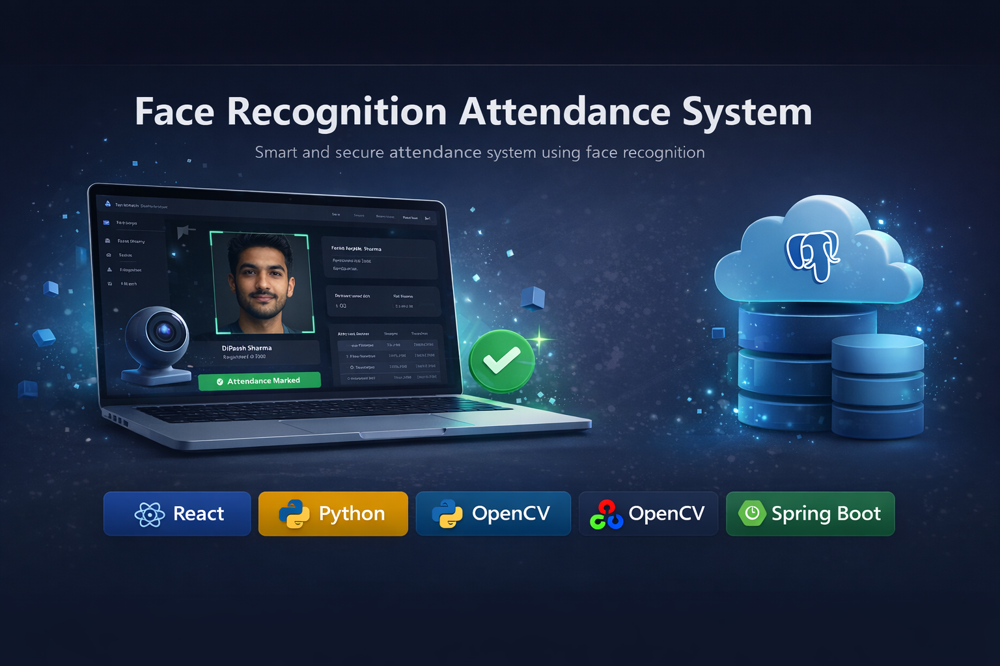
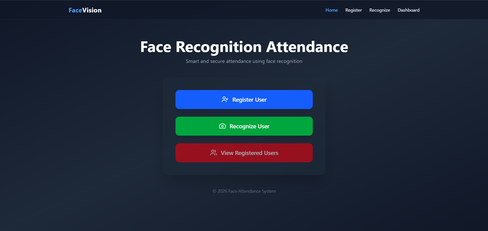
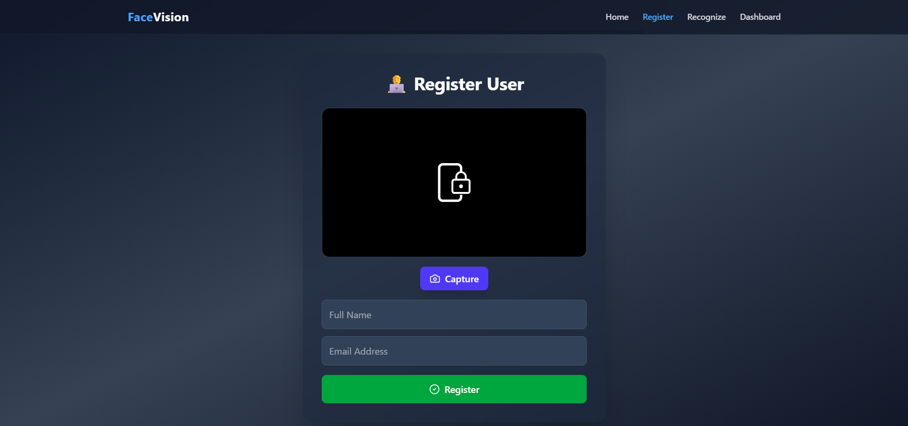
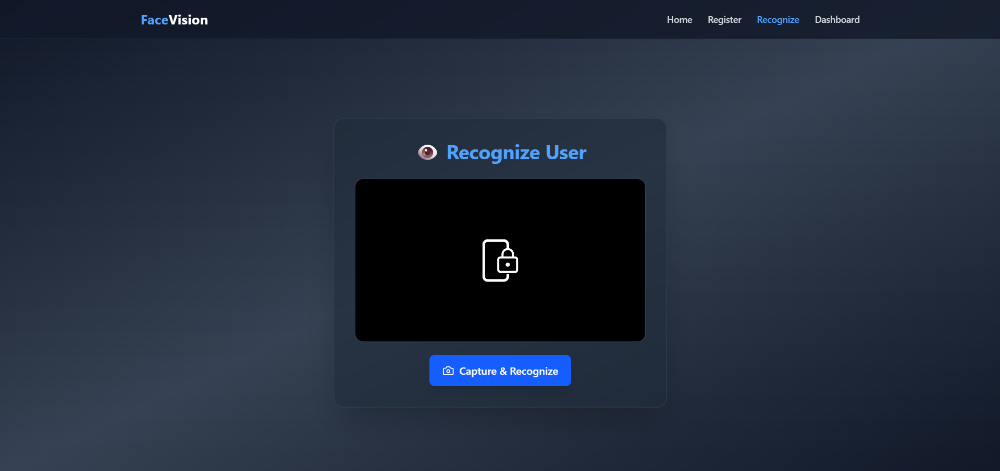
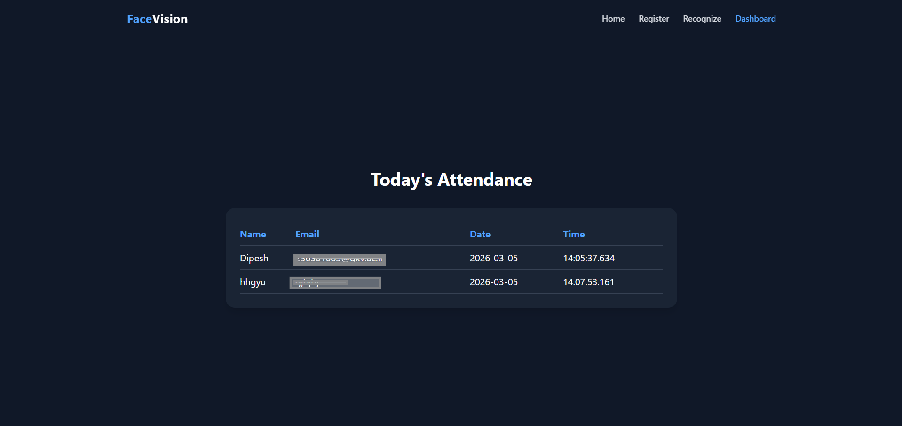

<h1 align="center">Face Recognition Attendance System</h1>
<p align="center">
  
</p>
<p align="center">
Smart and secure attendance system using AI-powered face recognition.
</p>
# 🎓 Face Recognition Attendance System


A **Face Recognition based Attendance System** that automatically detects and recognizes faces using a webcam and records attendance in real-time.
The project uses **Computer Vision and Machine Learning** to eliminate manual attendance marking.

---

# 🚀 Features

* 📸 Real-time face detection using webcam
* 🧠 Face recognition using trained facial encodings
* 📝 Automatic attendance marking
* 👤 Register new users with face data
* 📊 Attendance records management
* 🌐 Web interface for easy interaction

---

# 🧰 Tech Stack

### Frontend

* React
* HTML
* CSS
* JavaScript

### Backend

* Python
* Flask

### Computer Vision

* OpenCV
* Face Recognition Library
* NumPy

### Database

* CSV / Local storage

---

# 🏗️ System Architecture

```
User
  │
  ▼
Web Interface (React)
  │
  ▼
Backend API (Flask)
  │
  ▼
Face Recognition Engine
(OpenCV + face_recognition)
  │
  ▼
Attendance Storage (CSV / Database)
```

---

# 📸 Screenshots

## 🏠 Home Page



Main dashboard where users can choose to register or recognize faces.

---

## 👤 Register User



Users capture their face using the webcam and register with their details.

---

## 🎥 Face Recognition



The system detects and recognizes faces in real time.

---

## 📊 Attendance Dashboard



Displays attendance records and registered users.

---

# 📁 Project Structure

```
Face-Recognition-Attendance
│
├── Python
│   ├── dataset
│   ├── trainer
│   └── recognition
│
├── backend
│   ├── app.py
│   ├── routes
│   └── models
│
├── frontend
│   ├── src
│   ├── components
│   └── pages
│
├── screenshots
│   ├── home.png
│   ├── register.png
│   ├── recognize.png
│   └── dashboard.png
│
└── README.md
```

---

# ⚙️ Installation

### 1️⃣ Clone the repository

```
git clone https://github.com/Dipeshsharma2005/Face-Recognition-Attendance.git
cd Face-Recognition-Attendance
```

---

### 2️⃣ Install backend dependencies

```
pip install -r requirements.txt
```

---

### 3️⃣ Start backend server

```
python app.py
```

---

### 4️⃣ Start frontend

```
cd frontend
npm install
npm run dev
```

---


# 🔮 Future Improvements

* Mobile application support
* Cloud database integration
* Multi-camera support
* Admin dashboard with analytics
* Face recognition accuracy improvement

---

# 🤝 Contributing

Contributions are welcome!

Steps to contribute:

1. Fork the repository
2. Create a new branch
3. Commit your changes
4. Submit a Pull Request

---

# 👨‍💻 Author

**Dipesh Sharma**

GitHub
https://github.com/Dipeshsharma2005

LinkedIn
https://www.linkedin.com/in/dipesh-sharma-93236928a
